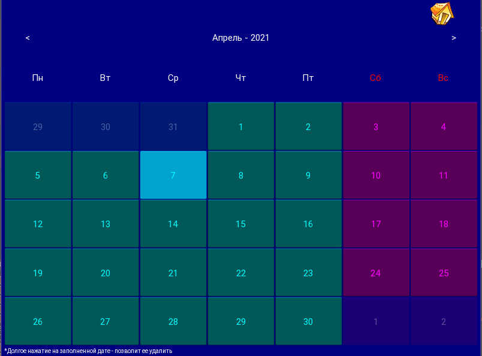
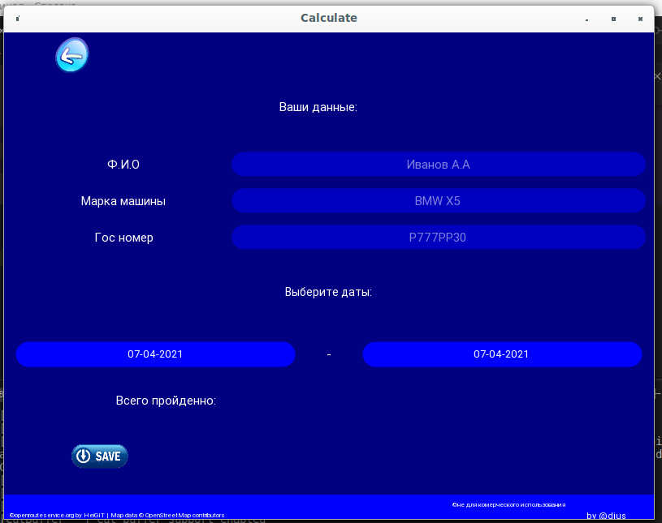
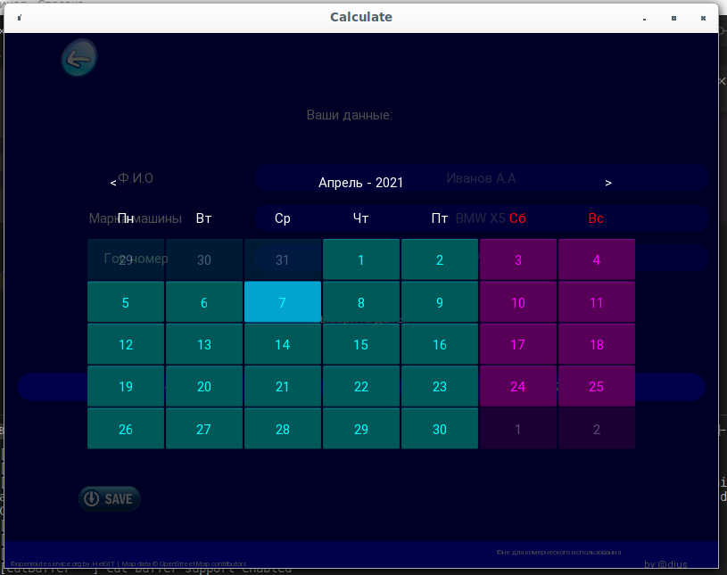
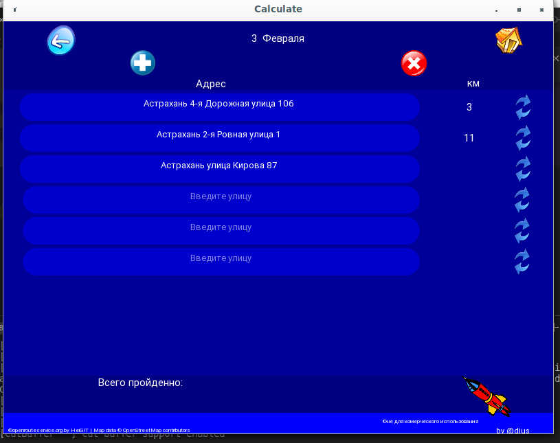
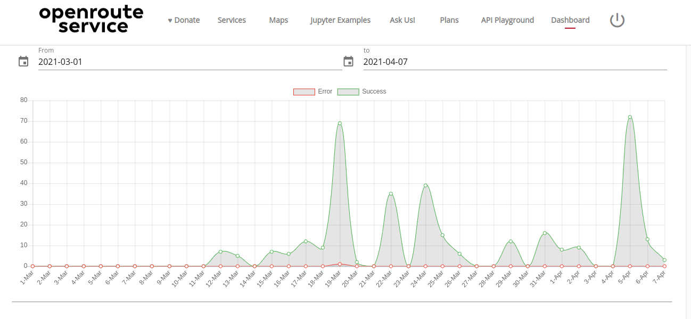

# CarInWay 
## CROSS-PLATFORM APP FOR CALCULATING DISTANCES BETWEEN TWO STREETS AND FOLLOWING IN EXCEL TRAVEL SHEETS.

Built on the    [Kivy](https://kivy.org/#home) library. Compiled with [buildozer](https://github.com/kivy/buildozer).
### Used technologies:
* pipenv (virtual environment)
* python
* Kivy
* sqlite
    * <a href="https://wiki.openstreetmap.org/wiki/Osmfilter" > Osmfilter </a> 
    * <a href="https://wiki.openstreetmap.org/wiki/Osmconvert" > Osmconvert </a>
* openrouteservice
* buildozer

More details can be found in [Pipfile.lock](Pipfile.lock)

This is my first application to use object oriented programming. So I haven't thought about any architecture yet. Designed for use in the workplace. At the moment I do not use, but others use the application.

### Video from YouTube with installing the application and using it.:

 
    

## screenshot of the application from the desktop version 

 
     </img>
    </img>
    </img>
    </img>

### request statistics openrouteservice.org

 
        

### The structure of the finished application 
├── main.py  
├── logs  
├── data  
│   ├── waybill.xlsx  
│   ├── img  
│   │   ├── save_2.png  
│   │   ├── refresh.png  
│   │   ├── home.png  
│   │   ├── go.png  
│   │   ├── f.png  
│   │   ├── delete.png  
│   │   ├── car.png  
│   │   ├── cancel.png  
│   │   ├── back.png  
│   │   ├── application2.png  
│   │   └── add.png  
│   ├── DateDistance  
│   ├── config.ini  
│   └── astrakhan.sqlite  
├── calculate.kv  
├── buildozer.spec  
└── bin  
    └── CarInWay-1.4.1.apk  

I deliberately do not include the folders with images and the database, so as not to violate copyrights by accident.
The city database was taken [OpenStreetMap Data Extracts](http://download.geofabrik.de/)  and transformed with tools such as [Osmfilter](https://wiki.openstreetmap.org/wiki/Osmfilter) and [Osmconvert](https://wiki.openstreetmap.org/wiki/Osmconvert) for use.

Refactoring in my spare time. 